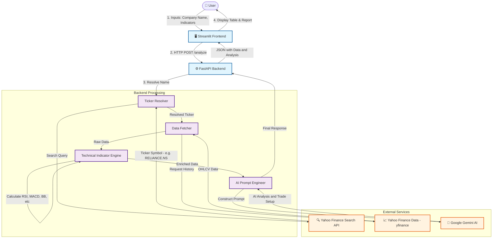

# System Architecture Flowchart

This document visualizes the data flow and component interactions within the Financial Analysis Tool.

```mermaid
graph TD
    %% Nodes
    User([👤 User])
    Frontend[🖥️ Streamlit Frontend]
    Backend[⚙️ FastAPI Backend]
    
    subgraph External_Services [External Services]
        YF_Search[🔍 Yahoo Finance Search API]
        YF_Data["📈 Yahoo Finance Data - yfinance"]
        Gemini[🧠 Google Gemini AI]
    end

    subgraph Backend_Logic [Backend Processing]
        Resolver[Ticker Resolver]
        Fetcher[Data Fetcher]
        Calculator[Technical Indicator Engine]
        Analyzer[AI Prompt Engineer]
    end

    %% Flow
    User -->|1. Inputs: Company Name, Indicators| Frontend
    Frontend -->|2. HTTP POST /analyze| Backend
    
    Backend -->|3. Resolve Name| Resolver
    Resolver -->|Search Query| YF_Search
    YF_Search -->|Ticker Symbol - e.g. RELIANCE.NS| Resolver
    
    Resolver -->|Resolved Ticker| Fetcher
    Fetcher -->|Request History| YF_Data
    YF_Data -->|OHLCV Data| Fetcher
    
    Fetcher -->|Raw Data| Calculator
    Calculator -->|Calculate RSI, MACD, BB, etc| Calculator
    
    Calculator -->|Enriched Data| Analyzer
    Analyzer -->|Construct Prompt| Gemini
    Gemini -->|AI Analysis and Trade Setup| Analyzer
    
    Analyzer -->|Final Response| Backend
    Backend -->|JSON with Data and Analysis| Frontend
    Frontend -->|4. Display Table & Report| User

    %% Styling
    classDef primary fill:#e1f5fe,stroke:#01579b,stroke-width:2px;
    classDef external fill:#fff3e0,stroke:#e65100,stroke-width:2px;
    classDef logic fill:#f3e5f5,stroke:#4a148c,stroke-width:2px;
    
    class Frontend,Backend primary;
    class YF_Search,YF_Data,Gemini external;
    class Resolver,Fetcher,Calculator,Analyzer logic;
```
