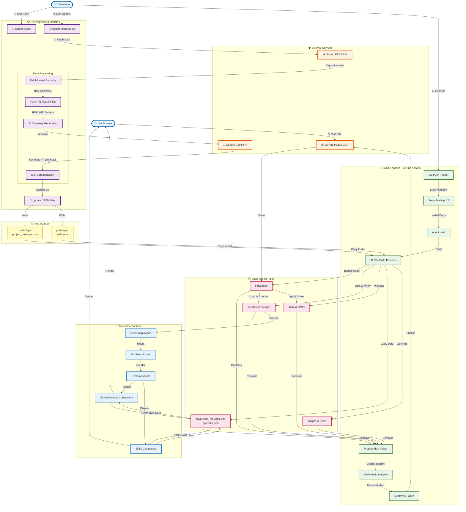

```mermaid
graph TD
    %% User & Developer Entry Points
    User([👤 User Browser])
    Dev([👨‍💻 Developer])
    
    %% External Services
    subgraph External_Services [🌐 External Services]
        GH_API[🔍 GitHub REST API]
        Gemini[🧠 Google Gemini AI]
        GH_Pages[📦 GitHub Pages CDN]
    end
    
    %% Development & Update Flow
    subgraph Development_Layer [💻 Development & Updates]
        Code[📝 Source Code]
        Update_Script[⚙️ update-projects.cjs]
        
        subgraph Data_Processing [Data Processing]
            Fetch_Commits[Fetch Latest Commits]
            Fetch_README[Fetch README Files]
            AI_Analysis[AI Summary Generation]
            Skill_Cat[Skill Categorization]
        end
        
        JSON_Update[📄 Update JSON Files]
    end
    
    %% Build & Deploy Pipeline
    subgraph CI_CD_Pipeline [🚀 CI/CD Pipeline - GitHub Actions]
        Trigger[Git Push Trigger]
        Setup[Setup Node.js 22]
        Install[npm install]
        Vite_Build[🏗️ Vite Build Process]
        Prepare[Prepare dist/ Folder]
        Verify[Verify Build Integrity]
        Deploy_Action[Deploy to Pages]
    end
    
    %% Static Assets
    subgraph Static_Assets [📦 Static Assets - dist/]
        HTML[index.html]
        JS_Chunks[JavaScript Bundles]
        CSS_Files[Tailwind CSS]
        API_JSON[api/project_rankings.json<br/>api/skills.json]
        Images[Images & Fonts]
    end
    
    %% Client Runtime
    subgraph Client_Runtime [⚡ Client-Side Runtime]
        React_App[React Application]
        Router[TanStack Router]
        Components[UI Components]
        Projects[GitHubProjects Component]
        Skills[Skills Component]
    end
    
    %% Data Storage
    subgraph Data_Storage [💾 Data Storage]
        Proj_JSON[public/api/<br/>project_rankings.json]
        Skills_JSON[public/api/<br/>skills.json]
    end
    
    %% Development Flow
    Dev -->|1. Edit Code| Code
    Dev -->|2. Run Update| Update_Script
    Update_Script -->|3. Fetch Data| GH_API
    GH_API -->|Repository Info| Fetch_Commits
    Fetch_Commits -->|New Commits?| Fetch_README
    Fetch_README -->|README Content| AI_Analysis
    AI_Analysis -->|Analyze| Gemini
    Gemini -->|Summary + Tech Stack| Skill_Cat
    Skill_Cat -->|Categorize| JSON_Update
    JSON_Update -->|Write| Proj_JSON
    JSON_Update -->|Write| Skills_JSON
    
    %% Build & Deploy Flow
    Dev -->|4. Git Push| Trigger
    Trigger -->|Start Workflow| Setup
    Setup -->|Install Deps| Install
    Install -->|Build| Vite_Build
    Vite_Build -->|Bundle Code| HTML
    Vite_Build -->|Split & Minify| JS_Chunks
    Vite_Build -->|Process| CSS_Files
    Vite_Build -->|Copy Data| API_JSON
    Vite_Build -->|Optimize| Images
    
    HTML -->|Contains| Prepare
    JS_Chunks -->|Contains| Prepare
    CSS_Files -->|Contains| Prepare
    API_JSON -->|Contains| Prepare
    Images -->|Contains| Prepare
    
    Proj_JSON -->|Copy to dist| Vite_Build
    Skills_JSON -->|Copy to dist| Vite_Build
    
    Prepare -->|Create .nojekyll| Verify
    Verify -->|Upload Artifact| Deploy_Action
    Deploy_Action -->|Publish| GH_Pages
    
    %% User Runtime Flow
    User -->|5. Visit Site| GH_Pages
    GH_Pages -->|Serve| HTML
    HTML -->|Load & Execute| JS_Chunks
    HTML -->|Apply Styles| CSS_Files
    JS_Chunks -->|Initialize| React_App
    React_App -->|Mount| Router
    Router -->|Render| Components
    Components -->|Display| Projects
    Components -->|Display| Skills
    Projects -->|Fetch| API_JSON
    Skills -->|Fetch| API_JSON
    API_JSON -->|Project Data| Projects
    API_JSON -->|Skills Data| Skills
    Projects -->|Render| User
    Skills -->|Render| User
    
    %% Styling
    classDef userDev fill:#e1f5ff,stroke:#01579b,stroke-width:3px
    classDef external fill:#fff3e0,stroke:#e65100,stroke-width:2px
    classDef development fill:#f3e5f5,stroke:#4a148c,stroke-width:2px
    classDef pipeline fill:#e8f5e9,stroke:#1b5e20,stroke-width:2px
    classDef assets fill:#fce4ec,stroke:#c2185b,stroke-width:2px
    classDef runtime fill:#e3f2fd,stroke:#1565c0,stroke-width:2px
    classDef storage fill:#fff9c4,stroke:#f57f17,stroke-width:2px
    
    class User,Dev userDev
    class GH_API,Gemini,GH_Pages external
    class Code,Update_Script,Fetch_Commits,Fetch_README,AI_Analysis,Skill_Cat,JSON_Update development
    class Trigger,Setup,Install,Vite_Build,Prepare,Verify,Deploy_Action pipeline
    class HTML,JS_Chunks,CSS_Files,API_JSON,Images assets
    class React_App,Router,Components,Projects,Skills runtime
    class Proj_JSON,Skills_JSON storage
```
