# Technical Architecture

This document describes the **technical architecture** of the portfolio application, covering system design, implementation details, deployment infrastructure, and codebase organization.

---

## Overview

The portfolio is a **static site generator (SSG)** application built with modern web technologies, featuring automated data updates via AI and continuous deployment via GitHub Actions.

### Tech Stack Summary

| Layer | Technology | Purpose |
|-------|-----------|---------|
| **Frontend** | React 18 | UI components and state management |
| **Meta-Framework** | TanStack Start | SSG, routing, file-based routing |
| **Styling** | Tailwind CSS 4 | Utility-first styling |
| **Build** | Vite | Fast bundling and dev server |
| **UI Components** | Radix UI | Accessible component primitives |
| **Animations** | Framer Motion | Smooth, declarative animations |
| **Icons** | Lucide React | Modern icon library |
| **AI** | Google Gemini 1.5 Flash | Project summary generation |
| **Data Source** | GitHub REST API | Project metadata |
| **Hosting** | GitHub Pages | Static site hosting |
| **CI/CD** | GitHub Actions | Automated deployment |

---

## System Architecture

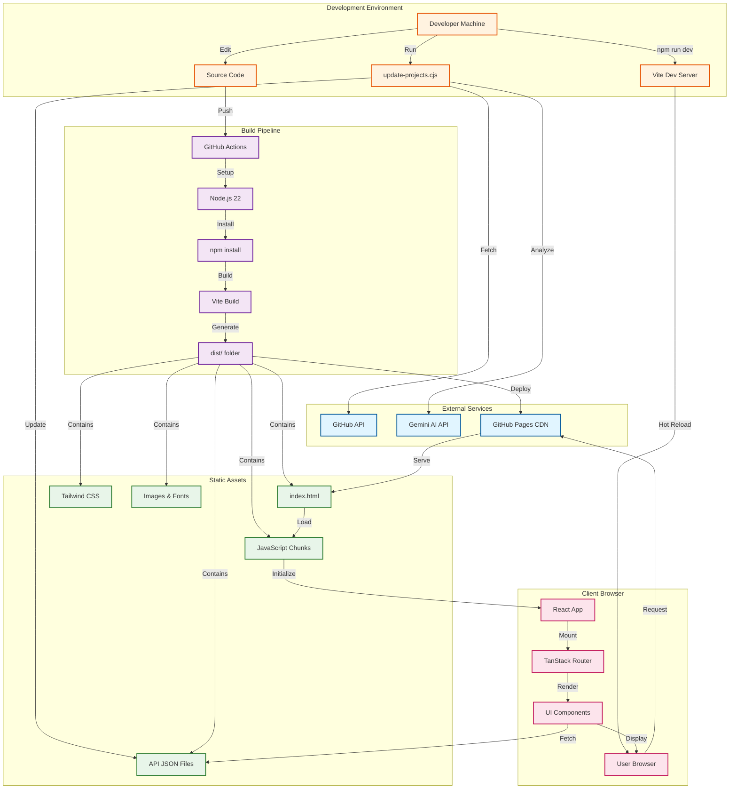

---

## Component Architecture

### Frontend Component Tree

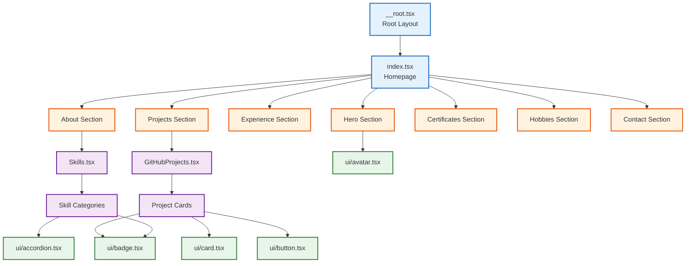

---

## Data Architecture

### Data Sources and Flow

```mermaid
flowchart LR
    subgraph "Source"
        GH_REPO[GitHub Repository:<br/>AI-PROJECTS]
    end
    
    subgraph "Processing Layer"
        UPDATE_SCRIPT[update-projects.cjs]
        GEMINI_API[Gemini AI API]
        CATEGORIZER[Skill Categorizer]
    end
    
    subgraph "Storage Layer"
        PROJ_JSON[public/api/<br/>project_rankings.json]
        SKILLS_JSON[public/api/<br/>skills.json]
    end
    
    subgraph "Build Layer"
        VITE[Vite Builder]
        DIST_PROJ[dist/api/<br/>project_rankings.json]
        DIST_SKILLS[dist/api/<br/>skills.json]
    end
    
    subgraph "Client Layer"
        FETCH[fetch API]
        STATE[React State]
        UI[UI Components]
    end
    
    GH_REPO -->|Fetch Commits| UPDATE_SCRIPT
    UPDATE_SCRIPT -->|Send README| GEMINI_API
    GEMINI_API -->|Return Analysis| UPDATE_SCRIPT
    UPDATE_SCRIPT -->|Extract Tech Stack| CATEGORIZER
    UPDATE_SCRIPT -->|Write| PROJ_JSON
    CATEGORIZER -->|Write| SKILLS_JSON
    
    PROJ_JSON -->|Copy| VITE
    SKILLS_JSON -->|Copy| VITE
    VITE -->|Bundle| DIST_PROJ
    VITE -->|Bundle| DIST_SKILLS
    
    DIST_PROJ -->|HTTP Request| FETCH
    DIST_SKILLS -->|HTTP Request| FETCH
    FETCH -->|Update| STATE
    STATE -->|Render| UI
    
    classDef source fill:#e1f5ff,stroke:#01579b
    classDef process fill:#fff3e0,stroke:#e65100
    classDef storage fill:#f3e5f5,stroke:#6a1b9a
    classDef build fill:#e8f5e9,stroke:#2e7d32
    classDef client fill:#fce4ec,stroke:#c2185b
    
    class GH_REPO source
    class UPDATE_SCRIPT,GEMINI_API,CATEGORIZER process
    class PROJ_JSON,SKILLS_JSON storage
    class VITE,DIST_PROJ,DIST_SKILLS build
    class FETCH,STATE,UI client
```

### Data Schema

#### project_rankings.json

```json
{
  "projects": [
    {
      "name": "string",
      "description": "string",
      "commits": "number",
      "commits_list": [
        {
          "sha": "string",
          "date": "ISO 8601 date",
          "message": "string"
        }
      ],
      "tech_stack": ["string"],
      "highlights": ["string"],
      "readme_url": "string",
      "repo_url": "string",
      "last_commit_date": "ISO 8601 date",
      "last_updated": "ISO 8601 date"
    }
  ]
}
```

#### skills.json

```json
{
  "Languages": ["Python", "JavaScript"],
  "AI/ML": ["TensorFlow", "PyTorch"],
  "Web Frameworks": ["React", "FastAPI"],
  "Databases": ["MongoDB", "PostgreSQL"],
  "Cloud & DevOps": ["AWS", "Docker"],
  "Data Tools": ["Pandas", "NumPy"],
  "Other": ["Git", "Linux"]
}
```

---

## Build System

### Vite Configuration

**File:** `vite.config.ts`

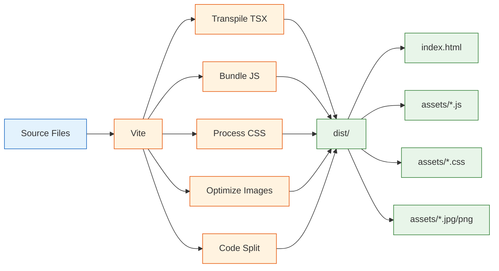

**Key Features:**
- **React Plugin:** JSX/TSX transformation
- **TanStack Router Plugin:** File-based routing
- **Code Splitting:** Automatic chunk optimization
- **Tree Shaking:** Remove unused code
- **Minification:** Compress JS/CSS
- **Asset Hashing:** Cache busting

### Build Process

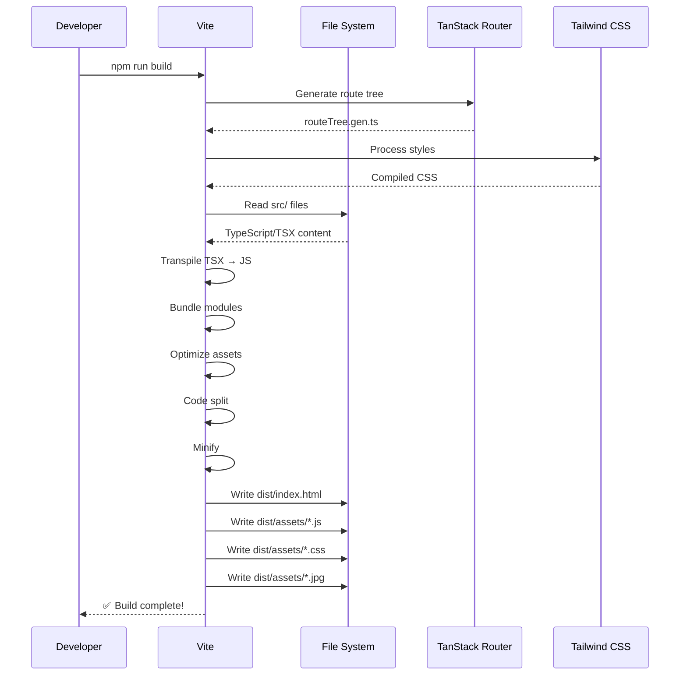

---

## Deployment Infrastructure

### GitHub Actions Workflow

**File:** `.github/workflows/deploy.yml`

```mermaid
flowchart TD
    A[Push to main] --> B[Trigger Workflow]
    
    B --> C{Build Job}
    C --> D[actions/checkout@v4]
    D --> E[actions/setup-node@v4<br/>Node 22]
    E --> F[npm install]
    F --> G[npm run build]
    
    G --> H[Prepare dist/]
    H --> I[Copy public/api/ → dist/api/]
    I --> J[Copy CNAME → dist/]
    J --> K[Create dist/.nojekyll]
    K --> L[Verify index.html]
    L --> M[Verify assets/]
    
    M --> N[actions/configure-pages@v4]
    N --> O[actions/upload-pages-artifact@v3]
    
    O --> P{Deploy Job}
    P --> Q[actions/deploy-pages@v4]
    Q --> R[GitHub Pages Server]
    R --> S[CDN Distribution]
    S --> T[reberog.github.io]
    
    classDef trigger fill:#fff3e0,stroke:#e65100
    classDef build fill:#e3f2fd,stroke:#1565c0
    classDef prepare fill:#f3e5f5,stroke:#6a1b9a
    classDef deploy fill:#e8f5e9,stroke:#2e7d32
    
    class A,B trigger
    class C,D,E,F,G build
    class H,I,J,K,L,M,N,O prepare
    class P,Q,R,S,T deploy
```

### Deployment Configuration

| Setting | Value | Purpose |
|---------|-------|---------|
| **Trigger** | `push` to `main`, `workflow_dispatch` | Auto-deploy on commit |
| **Node Version** | 22 | Match local dev environment |
| **Package Manager** | npm | Install dependencies |
| **Build Command** | `npm run build` | Generate static site |
| **Artifact Path** | `./dist` | Deploy only built files |
| **Base Path** | `/` | Root domain (not subdirectory) |

**Critical Files in dist/:**
- `.nojekyll` - Disables Jekyll processing (MUST exist)
- `CNAME` - Custom domain configuration (optional)
- `index.html` - Entry point
- `assets/` - Bundled JS/CSS
- `api/` - Project data JSON files

---

## API Integration

### GitHub API

**Purpose:** Fetch commit data and README files

**Authentication:** Personal Access Token (if needed for rate limits)

**Endpoints Used:**
```
GET /repos/{owner}/{repo}/commits
GET /repos/{owner}/{repo}/readme
GET /repos/{owner}/{repo}/contents/{path}
```

**Rate Limits:**
- Unauthenticated: 60 requests/hour
- Authenticated: 5000 requests/hour

### Gemini AI API

**Purpose:** Generate project summaries and extract metadata

**Model:** `gemini-1.5-flash`

**API Endpoint:**
```
POST https://generativelanguage.googleapis.com/v1beta/models/gemini-1.5-flash:generateContent
```

**Request Format:**
```javascript
{
  "contents": [
    {
      "parts": [
        {
          "text": "Analyze this README and extract:\n1. Summary\n2. Highlights\n3. Tech stack\n\n[README CONTENT]"
        }
      ]
    }
  ]
}
```

**Response Parsing:**
- Extract JSON from text response
- Validate schema
- Fallback to default values on error

---

## Security

### API Key Management

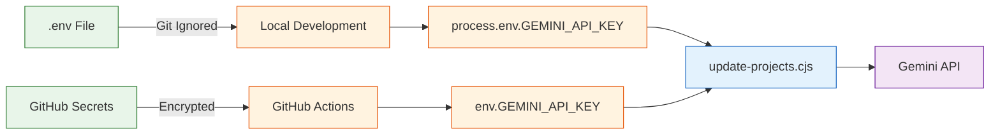

### Best Practices

1. **No Secrets in Code:** API keys only in `.env` and GitHub Secrets
2. **Git Ignore:** `.env` never committed
3. **Public Data:** All output data in `public/api/` is public
4. **No Sensitive Info:** Don't include private data in summaries
5. **Rate Limiting:** Respect GitHub and Gemini API limits

---

## Performance Optimizations

### Build-Time Optimizations

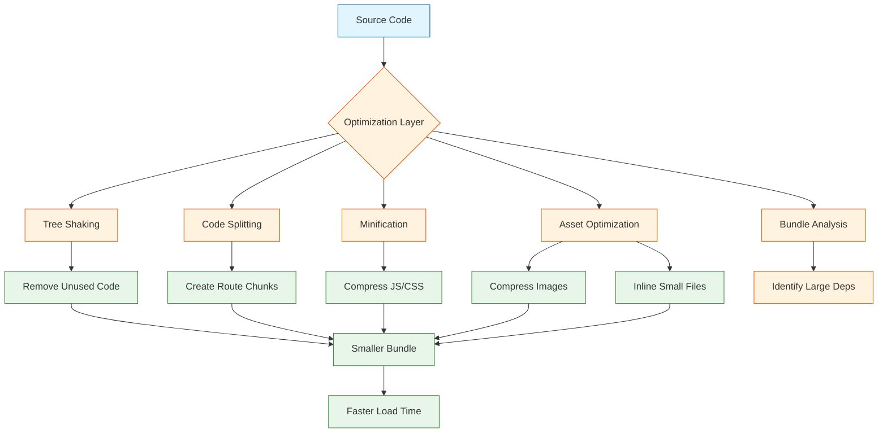

### Runtime Optimizations

| Technique | Implementation | Benefit |
|-----------|---------------|---------|
| **Lazy Loading** | React.lazy() for routes | Reduce initial bundle |
| **Image Optimization** | WebP format, lazy loading | Faster image loads |
| **CDN Caching** | GitHub Pages CDN | Global distribution |
| **Code Splitting** | Vite automatic chunks | Parallel downloads |
| **CSS Purging** | Tailwind JIT | Minimal CSS |
| **Preloading** | Link rel=preload | Faster critical resources |

---

## Error Handling & Monitoring

### Build Errors

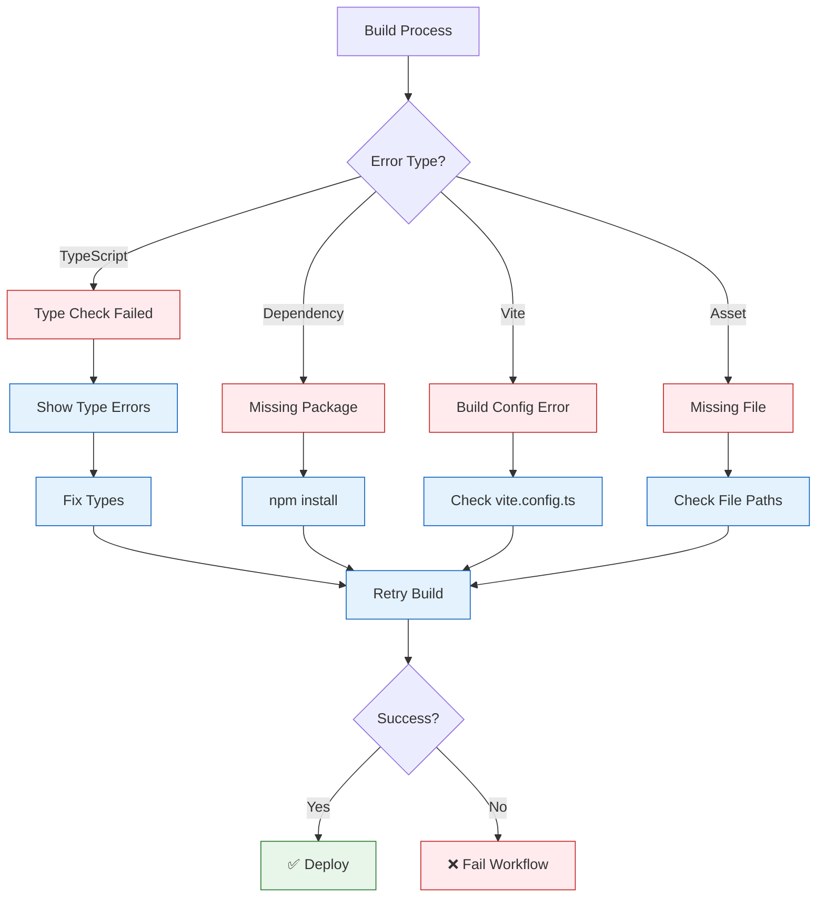

### Runtime Errors

**Error Boundaries:**
- Catch React component errors
- Display fallback UI
- Log to console

**API Failures:**
- Retry with exponential backoff
- Fallback to cached data
- Display user-friendly message

---

## Development Workflow

### Local Development

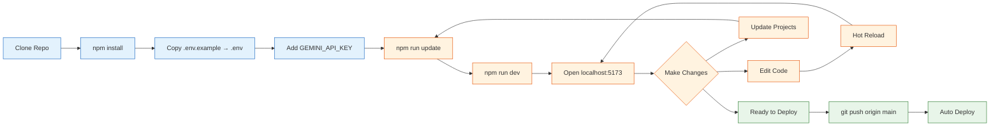

### Testing Strategy

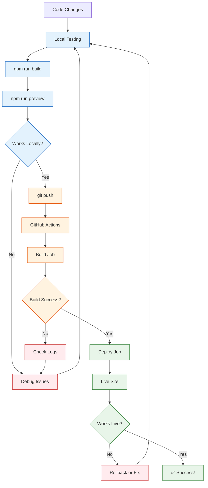

---

## File Structure Details

### Key Files Explained

| File | Purpose | Modification Frequency |
|------|---------|----------------------|
| `vite.config.ts` | Vite build configuration | Rarely |
| `tailwind.config.js` | Tailwind CSS settings | Occasionally |
| `tsconfig.json` | TypeScript compiler options | Rarely |
| `update-projects.cjs` | Auto-update script | Occasionally |
| `src/routes/index.tsx` | Homepage component | Frequently |
| `src/components/GitHubProjects.tsx` | Project display logic | Occasionally |
| `.github/workflows/deploy.yml` | CI/CD pipeline | Rarely |
| `public/api/*.json` | Data files (auto-generated) | Automatically |

### Environment Files

```
.env                    # Local secrets (git ignored)
.env.example            # Template for .env
.gitignore             # Files to exclude from git
.nojekyll (in public/) # Disable Jekyll (copied to dist/)
```

---

## Scaling Considerations

### Future Scalability

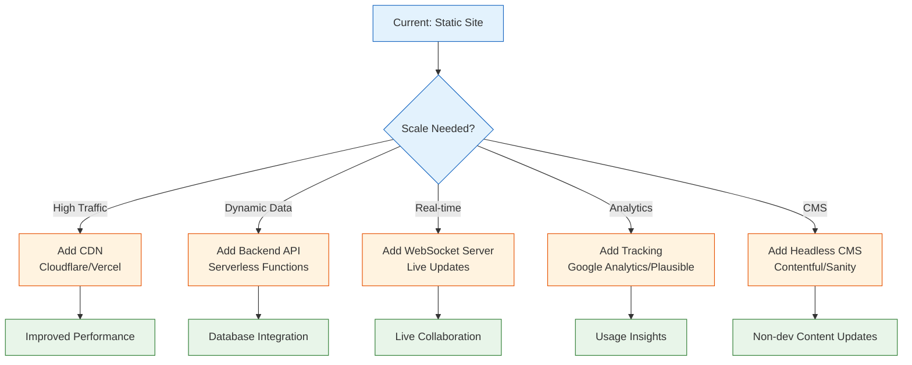

---

## Conclusion

This technical architecture provides a solid foundation for a modern, maintainable portfolio site. The combination of static generation, automated updates, and CI/CD ensures reliability and ease of maintenance.

**Key Technical Strengths:**
- ⚡ Fast build times with Vite
- 🔄 Automated updates with AI
- 🚀 Zero-downtime deployments
- 📦 Optimized bundle sizes
- 🔒 Secure secret management
- 🎯 Type-safe codebase with TypeScript

For functional behavior and user flows, see [ARCHITECTURE.md](./ARCHITECTURE.md).
